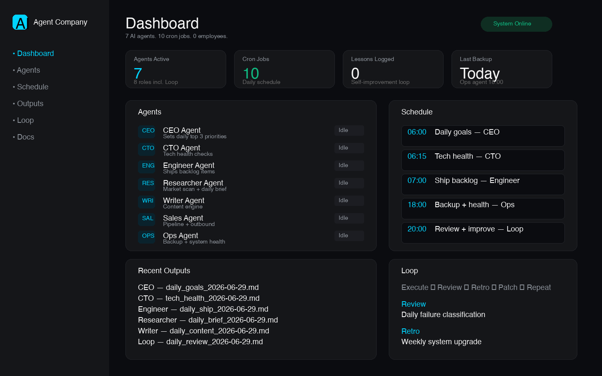

# One-Person AI Agent Company Template

Run a company with 7 AI agents, 10 cron jobs, and 0 employees.

## Dashboard

Open `dashboard/index.html` in your browser to see the live status of your agent company.

Run `python3 dashboard/generate_data.py` after a cron cycle to populate real output data.



## Structure

```
ai-company/
├── ceo/            # Direction, priorities, decisions
├── cto/            # Tech health, architecture, upgrades
├── engineer/       # Ship backlog items with tests
├── researcher/     # Market scan + daily brief
├── writer/         # Content engine
├── sales/          # Pipeline + outbound
├── ops/            # Backups, cron, system health
├── loop/           # Review / retro / self-improve
└── dashboard/      # Visual status UI
```

## Quick Start

1. Copy this folder into your project:
   ```bash
   cp -R one-person-ai-agent-company ~/my-ai-company/
   cd ~/my-ai-company
   ```

2. Install the crontab:
   ```bash
   cat ops/cron/crontab.txt | crontab -
   ```

3. Run one manual cycle to verify:
   ```bash
   bash ops/cron/06-ceo-daily-goals.sh
   bash ops/cron/07-cto-tech-health.sh
   bash ops/cron/08-engineer-ship.sh
   bash ops/cron/09-researcher-scan.sh
   bash ops/cron/10-writer-content.sh
   bash ops/cron/11-sales-inbox.sh
   bash ops/cron/12-sales-outbound.sh
   bash ops/cron/19-ops-backup-health.sh
   bash loop/run_loop.sh
   ```

4. Generate dashboard data:
   ```bash
   python3 dashboard/generate_data.py
   open dashboard/index.html
   ```

5. Review outputs in `*/outputs/` and the dashboard.

## Default Schedule

| Time | Agent | Job |
|---|---|---|
| 06:00 | CEO | Daily goals |
| 06:15 | CTO | Tech health |
| 07:00 | Engineer | Ship backlog |
| 08:00 | Researcher | Trend scan |
| 09:00 | Writer | Content draft |
| 10:00 | Sales | Lead inbox |
| 11:00 | Sales | Outbound draft |
| 18:00 | Ops | Backup + health |
| 20:00 | Loop | Daily review |
| 20:30 | Loop | Self-improve |

## Replace the Stub Runner

`ops/cron/run_agent.py` is a placeholder. Connect it to:
- Hermes CLI / Hermes runtime API
- OpenClaw MCP dispatch
- Claude Code non-interactive mode
- Kimi / OpenAI / local model endpoints

## Cost Control

- Stub mode: free, runs instantly, good for testing the loop
- Hermes mode: uses your configured model; run one script manually before enabling all 10 cron jobs
- Recommended: keep 06:00–20:30 schedule, review first week of real outputs before scaling

## Approval Gate

Any destructive or production action must write to `*/outputs/approval_needed_*.md`. Window 1 / human reviews before execution.

## BMA Service Business Variant

See `variants/bma-service-company/` for roles adapted to German fire-safety contractors: project manager, compliance officer, field engineer, customer success.
